# Docker-PostgreSQL

## Verificacion de la instalacion de postgre y la descarga de imagen

Se ejecuta los comandos para verificar la instalacion y version junto a la descarga de imagen de postgre

**Comando para verificar la instalacion**

~~~sql
docker --version
~~~

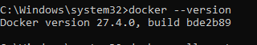

**Comando para descargar la imagen**

~~~sql
docker pull postgre
~~~

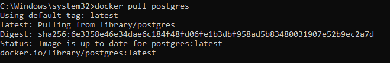

## Crear y ejecutar un contenedor con PostgreSQL

Ejecutar los comandos para crear y ejecutar el contenedor

**Comando para verificar la instalacion**

~~~sql
docker run --name mi_postgres -e POSTGRES_USER=admin -e POSTGRES_PASSWORD=admin123 -e POSTGRES_DB=mi_base -p 5432:5432 -d postgres
~~~

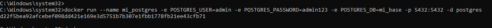

## Conectarse a PostgreSQL dentro del contenedor y crear la tabla "Estudiante"

Conexion a postgreSQL dentro del contenedor

**Comando para verificar la instalacion**

~~~sql
docker exec -it mi_postgres psql -U admin -d mi_base
~~~

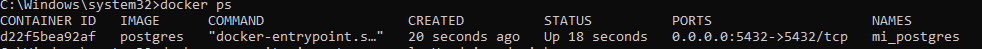

Creacion de la tabla

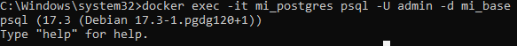

Verificar que la tabla fue creada correctamente

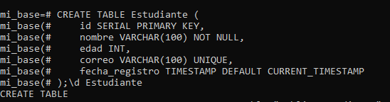

## Insertar y consultar datos

Insercion de estudiante     

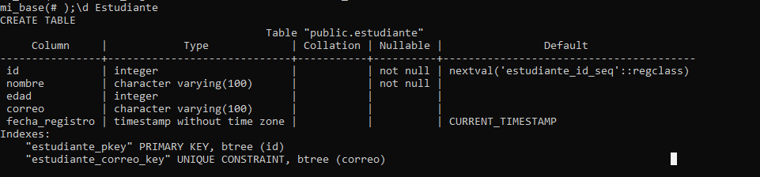

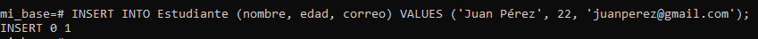

Consulta de datos

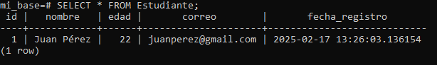

## Salir y detener el contenedor

Para salir de PostgreSQL:

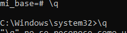

Para detener el contenedor:

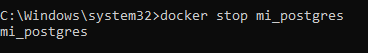

Para iniciarlo nuevamente:

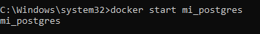
